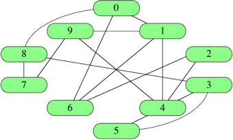

# Grafos
- Una estructura de datos para representar mútiples relaciones
- Es una estructura de tipo RED. En la jerarquía de las estructuras, es el caso más general que existe. 
- Un grafo mantiene una relación de “muchos a muchos” (N:M) entre sus elementos. 

## Terminología 
- Grafo: Conjunto de <b>nodos</b> y <b>arcos</b> (también llamados <b>vértices</b> y <b>aristas</b>).
- Nodo: Elemento básico de información. 
- Arco (edge): Liga que une dos nodos de un grafo (Establece relación entre dos elementos)
- Subgrafo: Grafo que contiene un subconjunto de nodos y arcos. 
- Nodos adyacentes: Nodos que tienen un arco que los conecta. 
- Vecinos de un nodo: Todos los nodos que son adyacentes al nodo. 
- Grado de un nodo: Cantidad de vecinos que tiene el nodo. Cardinalidad.
- Camino o trayectoria: Secuencia de nodos, de tal forma que cada par de nodos consecutivos son adyacentes.
- Trayectoria simple: Camino donde todos los nodos contenidos son distintos. 

<b>Grafos No-Dirigidos vs Grafos Dirigidos</b>
- Grafo No-Dirigido: Los arcos en el grafo no tienen ninguna dirección en particular, se consideran bidireccionales. 
    - Un arco de A-B es igual que uno de B-A.
- Grafo Dirigido: Los arcos tienen dirección. El primer elemento del arco es denominado el <b>origen</b> y el segundo es el <b>destino</b>.
    - Un arco de A-B no es igual que uno de B-A.

- Grafo ponderado: 
    - Los arcos en el grafo tienen asociado un valor (peso) 
    - Estos pueden estar relacionados con distancia, costos, etc. 

- Ciclo: Trayectoria en la que el nodo de inicio y el nodo de terminación, son el mismo. 

## Representación de Grafos
Hay diferentes maneras de representar grafos. 
Tenemos, por ejemplo, el siguiente grafo: 

  

### Matriz de Adyacencia 
Para un grafo con |N| nodos, su matriz de adyacencia es una matriz |N| x |N|.  
Si el espacio M[i][j] = 1, indica que hay un arco del nodo i al nodo j.  
Si el espacio M[i][j] = 0, indica que no hay un arco del nodo i al nodo j.  
Las matrices de adyacencia para grafos no-dirigidos son simétricas.  
También se pueden usar las matrices de adyacencia para representar grafos con peso:  
Si M[i][j] = w, entonces hay un arco del nodo i al nodo j, con un peso de w. 

 
Usando el grafo de ejemplo, la matriz de adyacencia es: 

  

 

### Listas de Adyacencia
Para cada nodo i, se almacena una lista de los nodos adyacentes en un arreglo.
 
A[i] representa la lista de nodos adyacentes al nodo i. 
 
Se puede usar para representar un grafo con peso, con una lista de pares. 

 
Usando el grafo de ejemplo, la lista de adyacencia es: 

  

