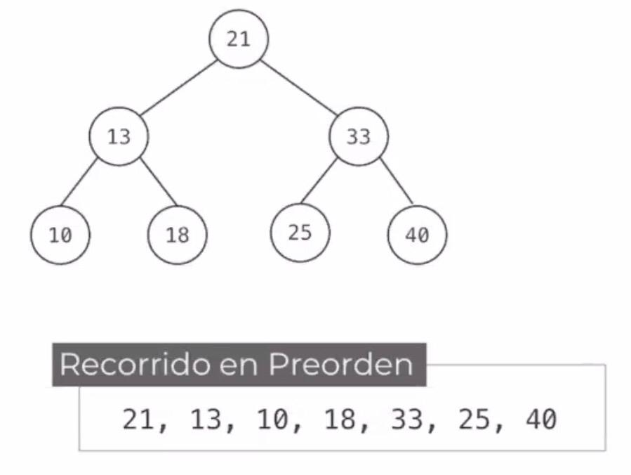

# Árboles 

## ¿Qué son? 
- Estructura de datos jerárquica
- La relación entre elementos es de uno a muchos

## Terminología
- Nodo: Cada elemento de un árbol
- Nodo Raíz: Primer elemento agregado al árbol
- Nodo Padre: Se le llama así al nodo predecesor de un elemento
- Nodo Hijo: Es el nodo sucesor de un elemento
- Nodos Hermanos: Nodos que tienen el mismo nodo padre
- Nodo Hoja (Nodo Externo): Nodo que no tiene hijos
- Nodo Interno: Todos los nodos que tienen padre e hijos
- Subárbol: Todos los nodos descendientes por la izquierda o derecha de un nodo. 
- Altura de un nodo: Es el número de nodos del camino más largo de ese nodo a una hoja. 
- Profundidad de un nodo: Es la longitud del camino único que va desde la raíz hasta el nodo. 

## Recorridos
Recorrer el árbol es "pasar por" o "visitar" todos los nodos del mismo
- Recorridos típicos: 
  1. Preorden 
  2. Inorden
  3. Postorden
- Otros recorridos: 
  - Conversos
  - Nivel por nivel
  
Aplicándose en un árbol binario: 
### 1. PreOrden
#### Proceso: 
- Visita el nodo raíz 
- Recorre en preorden el subárbol izquierdo de la raíz
- Recorre en preorden el subárbol derecho

Tip: La raíz queda al inicio
<p>
  
</p>

### Implementación
```cpp
void preorden(Nodo *Root){
    if (Root != null){
        cout << *Root
        Preorden (R->izq); 
        Preorden(R->der); 
    }
}
```

#### Aplicación 
- Generar una réplica de un árbol

### 2. InOrden
#### Proceso
- Recorre en inorden el subárbol izquierdo
- Visita la raíz
- Recorre en inorden el subárbol derecho

Tip: La raíz queda en medio

#### Implementación 
```cpp
void inorden(Nodo *Root){
    if (Root != null){
        inorden (R->izq); 
        cout << *Root
        inorden(R->der); 
    }
}
```

#### Aplicación 
- Desplegar en orden creciente los elementos del árbol si este es un ABB (BST).

### 3. PostOrden
#### Proceso
- Recorre en postorden el subárbol izquierdo
- Recorre en postorden el subárbol derecho
- Visita la raíz

Tip: La raíz queda al final 

#### Implementación 
```cpp
void postorden(Nodo *Root){
    if (Root != null){
        postorden (R->izq); 
        postorden(R->der); 
        cout << *Root
    }
}
```

#### Aplicación 
- Liberar los nodos de un árbol.

### Recorridos Conversos
- Visitan los nodos en orden contrario: primero la derecha y después la izquierda
- No es muy común encontrar aplicación para ellos
1. Preorden Converso (R, D, I)
2. Inorden Converso (D, R, I)
3. Postorden Converso (D, I , R)

