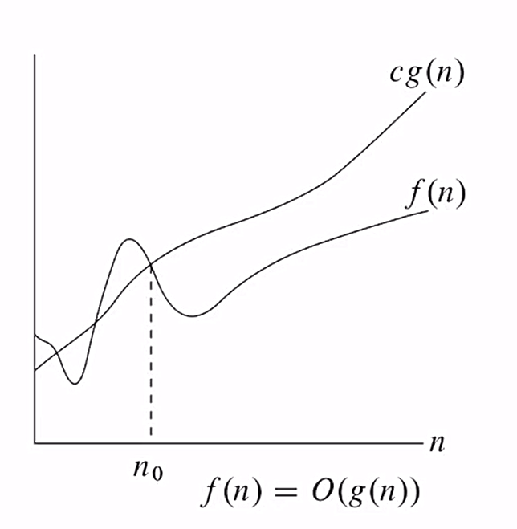
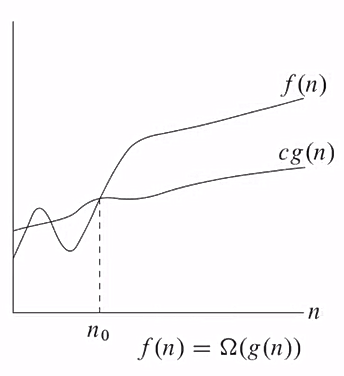
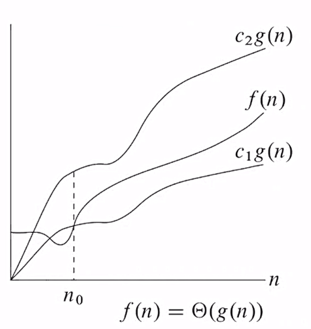
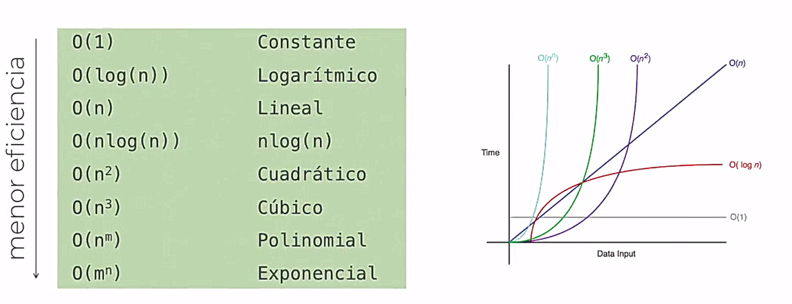

# Clase 3: Análisis de Algoritmos

## Contenido
  [1. Introducción al análisis de algoritmos](#1-introducción-al-análisis-de-algoritmos)
  * [Solución a problemas](#solución-a-problemas)
  * [¿Qué es un algoritmo?](#-qué-es-un-algoritmo-)
  * [¿Por qué estudiamos algoritmos?](#-por-qué-estudiamos-algoritmos-)
  * [¿Por qué es importante el análisis de algoritmos?](#-por-qué-es-importante-el-análisis-de-algoritmos-)
  * [Eficiencia de un algoritmo](#eficiencia-de-un-algoritmo)
    + [¿Cómo se evalúa?](#¿cómo-se-evalúa-)
 
[2. Complejidad Computacional](#2-complejidad-computacional)
  * [Complejidad Temporal](#complejidad-temporal-)
  * [Complejidad Espacial](#complejidad-espacial-)

[3. Notación Asintótica](#3-notación-asintótica)
  * [Notación O Grande (Big-O Notation)](#notación-o-grande--big-o-notation-)
- [Notación Ω (Omega)](#notación-Ω-omega-)
- [Notación Θ (Theta)](#notación-Θ-theta-)
- [Propiedades](#propiedades)
- [Orden de Complejidad](#orden-de-complejidad)

# 1. Introducción al análisis de algoritmos 

## Solución a problemas
Para encontrar una solución tenemos que tomar en cuenta: 
- Si conocemos un buen método para resolver el problema.
- Los problemas pueden agruparse en un conjunto de problemas que son semejantes.
- Un método que puede solucionar todos los problemas de un conjunto dado, se considera superior a un método que soluciona únicamente un problema del conjunto. 
- Hay criterios para determinar qué tan "buena" es una solución.

## ¿Qué es un algoritmo?
Un algoritmo es una serie finita de pasos para resolver un problema.  
Hay que hacer énfasis en dos aspectos: 
- El número de pasos debe ser finito. (El algoritmo termina)
- El algoritmo debe ser capaz de determinar la solución del problema. 

## ¿Por qué estudiamos algoritmos? 
Gran parte de la materia se enfoca en estudiar algoritmos, desde el punto de vista de la eficiencia.  
Las computadoras son rápidas y tenemos una Ley de Moore, la cual dice que la capacidad de cómputo se duplica cada cierto tiempo, entonces <b>¿Por qué es necesario? </b>
- Evita reinventar la rueda
- Algoritmos eficientes derivan en programas eficientes
  - Hacen un mejor uso de los recursos (que equivale a un mejor uso del dinero)
- Los programadores que escriben programas eficientes son mejor valorados

## ¿Por qué es importante el análisis de algoritmos? 
Nos permite: 
- Predecir la cantidad de recursos:
  - Almacenamiento
  - Tiempo de cómputo
  - Número de operaciones
- Velocidad de ejecución de un algoritmo
- Determinar bajo qué circunstancias un algoritmo es mejor que otro
  
Esto se puede valorar en cuanto al tiempo de CPU, uso de memoria y ancho de banda. 

## Eficiencia de un algoritmo
### ¿Cómo se evalúa? 
Midiendo los recursos: <b>espacio</b> y <b>tiempo. </b>  
Para esto hay dos enfoques que podemos usar: 
1. A priori (teórico): Obtener una expresión que indique el comportamiento del algoritmo en función de los parámetros. 
2. A posteriori (empírico): Se recogen estadísticas de tiempo y espacio consumidos por el algoritmo mientras se ejecuta. Requiriendo de: 
     - una maquina concreta
     - un lenguaje concreto
     - un compilador concreto
     - datos concretos

# 2. Complejidad Computacional
Se divide en dos: 
## Complejidad Temporal :alarm_clock:
- Se denota como T(n)
- Es el tiempo que requiere para procesar una entrada de tamaño n
- Sea T(n) la complejidad temporal de algún programa, se asume lo siguiente: 
  - El argumento n es un entero no negativo
  - T(n) es no negativo para todo n  
  (Estamos hablando de tiempo)

## Complejidad Espacial :file_folder:
- Se denota como S(n)
- Es la cantidad de espacio que requiere un programa para procesar una entrada de tamaño n

# 3. Notación Asintótica
Son las maneras de evaluar teóricamente la complejidad de un algoritmo.

## Notación O Grande (Big-O Notation)
- $f(n)$ es $O(g(n))$ si $f$ crece a lo sumo tan rápido como $g$
- $f(n)$ es $O(g(n))$ si existe un entero $n_{0}$ y una contante $c>0$, tal que, para todos los enteros $n\ge n_{0}$ se cumple que: $f\left(n\right)\ \le\ cg\left(n\right)$

  

# Notación Ω (Omega) 
- $f(n)$ es $Ω(g(n))$ si $f$ crece a lo sumo tan rápido como $g$
- $f(n)$ es $Ω(g(n))$ si existe un entero $n_{0}$ y una contante $c>0$, tal que, para todos los enteros $n\ge n_{0}$ se cumple que: $f\left(n\right)\ \ge\ cg\left(n\right)$
  

  

# Notación Θ (Theta) 
- $f(n)$ es $Θ(g(n))$ si $f$ y $g$ crecen igual
- $f(n)$ es $Θ(g(n))$ si: 
  - $f\left(n\right)\ =\ O\left(g\left(n\right)\right)$ y, 
  - $f\left(n\right)\ =\ Ω\left(g\left(n\right)\right)$

  

## Propiedades
1. Transitividad
   - Si $f(n)$ es $O(g(n))$ y $g(n)$ es $O(h(n))$, entonces $f(n)$ es $O(h(n))$
   - Lo mismo para Ω y Θ
2. Reflexividad
   - Si $f(n)$ = $O(f(n))$
   - Lo mismo para Ω y Θ
3. Simetría
   - $f(n)$ es $Θ(g(n))$ si y sólo si $g(n)$ es $Θ(f(n))$
4. Simetría transpuesta
   - $f(n)$ es $O(g(n))$ si y sólo si $g(n)$ es $Ω(f(n))$

## Orden de Complejidad

  

